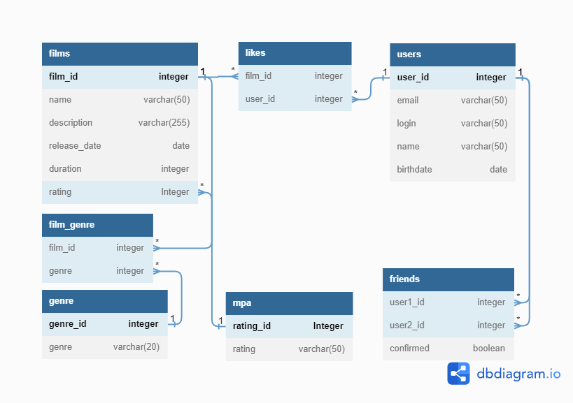

# java-filmorate

Java filmorate DB scheme

## Samples of requests:

### Get all films:
SELECT *
FROM films;

### Get all users
SELECT *
FROM users;

### Get films liked by user
SELECT *
FROM films
WHERE film_id IN 
(
    SELECT film_id
    FROM likes
    WHERE user_id = {id}
);

### Get common friends
SELECT *
FROM users AS u
WHERE ((u.user_id IN \
(
    SELECT user2_id
    FROM friends
    WHERE user1_id = {id1} AND confirmed = true
)) OR (u.user_id IN (
    SELECT user1_id
    FROM friends
    WHERE user2_id = {id1} AND confirmed = true
)))
AND ((u.user_id IN (
    SELECT user2_id
    FROM friends
    WHERE user1_id = {id2} AND confirmed = true
)) OR (u.user_id IN (
    SELECT user1_id
    FROM friends
    WHERE user2_id = {id2} AND confirmed = true
)));

### Get top liked films
SELECT f.name,
COUNT(l.film_id) AS likes_number
FROM likes AS l
LEFT JOIN films AS f ON f.film_id = l.film_id
GROUP BY f.name
ORDER BY likes_number DESC
LIMIT {count};

### Find user
SELECT *
FROM users
WHERE user_id = {id}

### Find film
SELECT *
FROM films
WHERE film_id = {id}

### Find friends
SELECT *
FROM users
WHERE user_id IN (
    SELECT user2_id
    FROM friends
    WHERE user1_id = {id} AND confirmed = true
) OR user_id IN (
    SELECT user1_id
    FROM friends
    WHERE user2_id = {id} AND confirmed = true
);